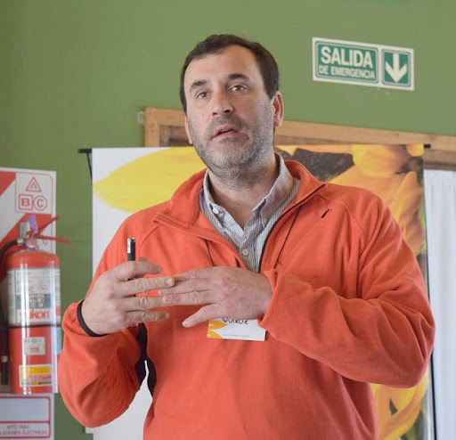
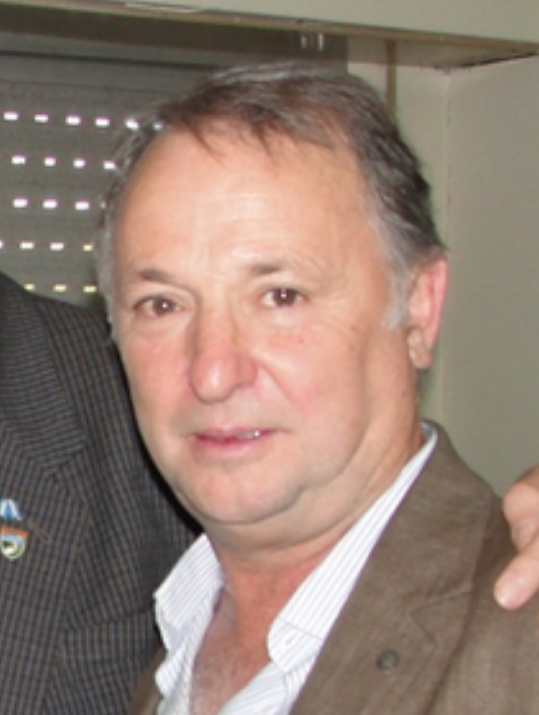
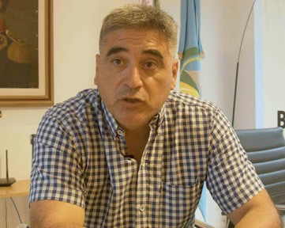

> _El sistema permite adecuar los diseños de políticas de intervención de acuerdo a lo que esté sucediendo en la localidad, lo cual implica que se pueden tomar decisiones basadas en datos e informaciones provenientes de la ciencia y tecnología. Es una oportunidad que permite dar un salto cualitativo con resultados relevantes para la comunidad. La decisión política de implementarlo permitirá dar un paso hacia la innovación en la gestión municipal frente al COVID19_
>**Facundo Quiroz, director de la EEA INTA Balcarce** 

---

_En este escenario de pandemia, la propuesta permite tomar decisiones con datos e información relevada, validada y analizada en tiempo real. Es momento de poner a disposición nuestros recursos. La prioridad es la comunidad”_

**Miguel Pereyra Iraola, Vicedecano de la Facultad de Ciencias Agrarias de la UNMdP**

---

_Es trascendental que el control de la epidemia podamos centrarlo en el comportamiento social, no basta con detectar personas con síntomas. Es por ello que en esta propuesta, estamos integrando a poblaciones en estado de vulnerabilidad, quienes no suelen tener acceso a la salud o a la información”_

**Francisco Gonzáles, coordinador del Primer Nivel de Atención del Hospital Fossati**

---

_Estamos trabajando en la presentación de un proyecto conjunto en la Agencia Nacional de Promoción de la Investigación, Desarrollo Tecnológico y la Innovación. Esto podría ayudarnos a mejorar tanto nuestra capacidad diagnóstica como el manejo epidemiológico frente a eventos de esta naturaleza y magnitud"_ 

**Julián Verona, jefe de laboratorio del nosocomio**

---

Equipo completo de colaboradores: en construcción
