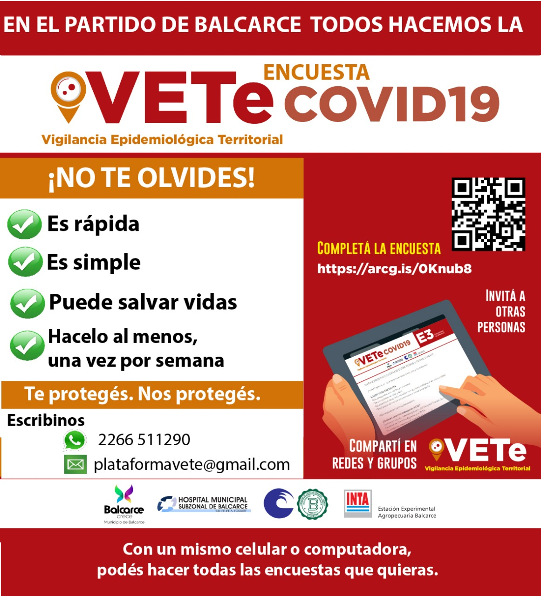

## ¿Por qué es importante participar?

La información suministrada en la encuesta permitirá a VETe:

- detectar síntomas individuales de modo masivo para influir en la cadena de transmisión con el fin de disminuir o cortar el contagio social
- identificar anticipadamente potenciales focos o conglomerados de infección en las localidades y pronosticar y analizar conductas individuales y sociales frente al aislamiento
- monitorear y acompañar a las personas en cuarentena
- generar alertas tempranas
- predecir escenarios en la prestación de servicios públicos, no solo en el sistema de salud
- tomar decisiones con datos, información respaldado en la ciencia y tecnología
- colaborar con la intervención municipal

## Política de privacidad y tratamiento de datos

(en construcción) (link a términos y condiciones)
