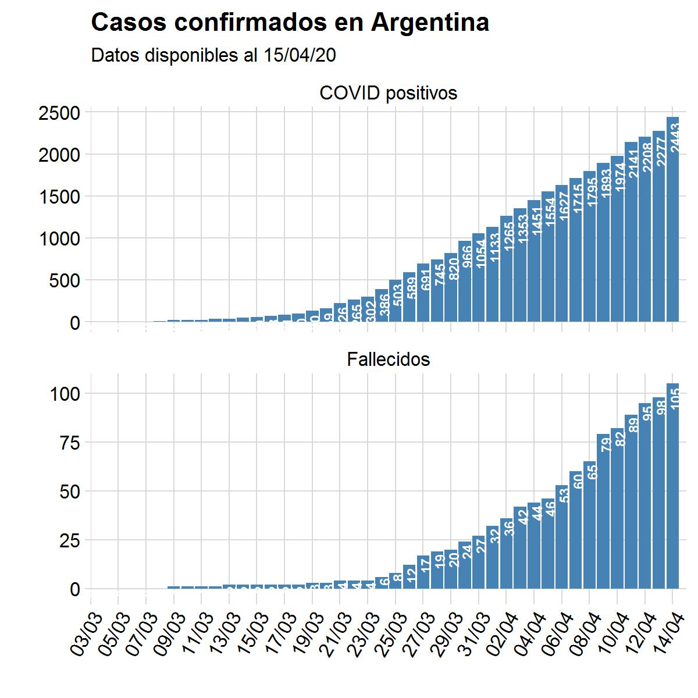

## Estadísticas

Estadísticas globales

Estadísticas MERCOSUR

Estadísticas Argentina

Estadísticas partido de Balcarce y aledaños

---

## Proyecciones

Este gráfico muestra una proyección sencilla de los casos en Argentina

### Modelado epidemiológico 

Estamos trabajando para realizar proyecciones específicas para el partido de Balcarce, utilizando modelos epidemiógicos. Estos modelos permiten explicar y predecir el comportamiento de agentes infecciosos y potencialmente dañinos para las poblaciones humanas (en este caso). 

En este caso haremos uso de un modelo clasico de epidemiologia de enfermedades infecto-contagiosas conocido com "SEIR", de sus siglas: "S" individuos - "E" expuestos - "I" infectados - "R" recuperados.

S-Susceptible, E-expuesto (infectado), I-Infeccioso (que contagia) y R-Recuperado
H-hospitalizados, C-críticos (UCI), y D - difuntos.  
S -> I modelado por tasa de infección (R0)(R0 afectado por las intervenciones “Int” y la estacionalidad “∿”). Ld: período de latencia; Id:periodo infeccioso. 

---

## Fuentes de datos

COVID-19 Global: [Johns Hopkins CSSE](https://github.com/CSSEGISandData/COVID-19)

COVID-19 Argentina: [Sistemas Mapache](https://github.com/SistemasMapache/Covid19arData)

COVID-19 Buenos Aires:  [Ministerio de Salud de Buenos Aires](https://www.gba.gob.ar/saludprovincia/boletin_epidemiologico)
