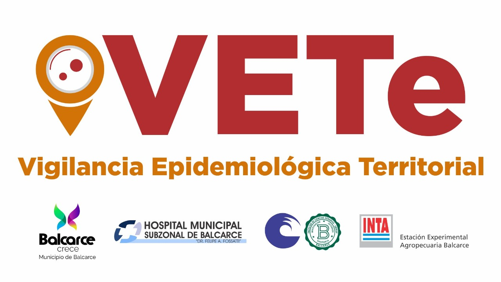

 
## ¿Qué es VETe?

El proyecto “Vigilancia Epidemiológica Territorial” (VETe), es una herramienta integral creada por la Facultad de Ciencias Agrarias de la Universidad Nacional de Mar del Plata, el INTA Balcarce, profesionales del Hospital Fossati, del municipio de Balcarce y de la UBA.  

El sistema VETe permite:

* detectar síntomas individuales de modo masivo para influir en la cadena de transmisión con el fin de disminuir o cortar el contagio social
* identificar anticipadamente potenciales focos o conglomerados de infección en las localidades y pronosticar y analizar conductas individuales y sociales frente al aislamiento
* monitorear y acompañar a las personas en cuarentena
* generar alertas tempranas
* predecir escenarios en la prestación de servicios públicos, no solo en el sistema de salud
* tomar decisiones con datos, información respaldado en la ciencia y tecnología
* colaborar con la intervención municipal

El sistema VETe estará disponible tanto para municipios como otros niveles del Estado, empleando diversas herramientas, como encuestas autogestionadas, telefónicas, georreferenciones (GIS), modelización predictiva, monitoreo de casos, entre otras. 
