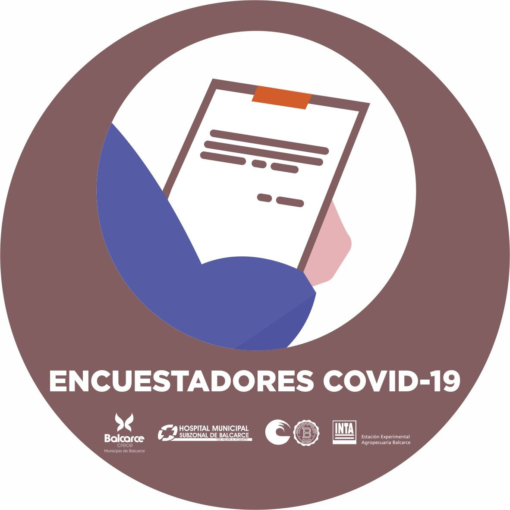

## Cómo nos organizamos

En grupos de trabajo, donde se abordan algunos temas específicos del proceso. Está integrado por profesionales de diversas disciplinas, conocimientos y experiencias. 

Interinstitucionales: INTA + FCA + Municipio + Hospital

Transdisciplinarios: medicina, estadística, modelización, comunicación, agronomía, epidemiología, veterinaria, gestión de políticas públicas, gestión del Estado y la administración pública, gestión de la ciencia,  otros

---

Este grupo es de gestión, integra y operativiza aquellas acciones que se trabajan en los demás grupos de trabajo. Se constituye como ámbito de enlace con el equipo de “CONTROL COVID-19 operativo”, el cual está gerenciado por las autoridades Municipales del Hospital y de la Policía (Comunal, bonaerense y DDI). 
 

---

Realiza una difusión selectiva de información (DSI) suministrando información especializada al resto de los grupos de trabajo, mediante acceso a bibliotecas y revistas científicas del mundo. 
Se encarga de crear repositorios de la información generada en el ámbito de trabajo de los diferentes grupos.
Busca bibliografía internacional, actualiza conceptos, sistematiza información bibliográfica, facilita la construcción de marcos teóricos y estado del arte. Es uno de los grupos que realiza el seguimiento de la comunidad científica internacional.
 

---

Diseña procesos y construcción de herramientas, según las necesidades de información que se requiera. En este espacio se discute y diagrama, por ejemplo, tipo de encuestas, preguntas, alternativas para la implementación, entre otros.
 

---

Grupo de trabajo para la para implementación del objetivo 2, mediante encuestadores y encuestadoras voluntario/as. Entre sus responsabilidades, está la conformación de grupos de encuestadores, capacitación e implementación de encuestas telefónicas, entre otras.
 

---

Se ocupa de la georreferenciación de los datos y transformación de información en diversos tipos de mapas o cartografía. Se compatibilizan e integran herramientas e información.
 

#

Este grupo de trabajo integra la información generada tanto en los otros de diversas otras fuentes.
Analiza los resultados de las encuestas, genera modelos predictivos locales y evalúa nuevos estudios. 
Busca adelantarse en la construcción de escenarios (simulación mediante modelos predictivos) de impacto del COVID-19 en Balcarce y en la identificación de casos o focos del virus.
Los múltiples análisis y conclusiones, son una herramienta para la toma de decisiones.
 

