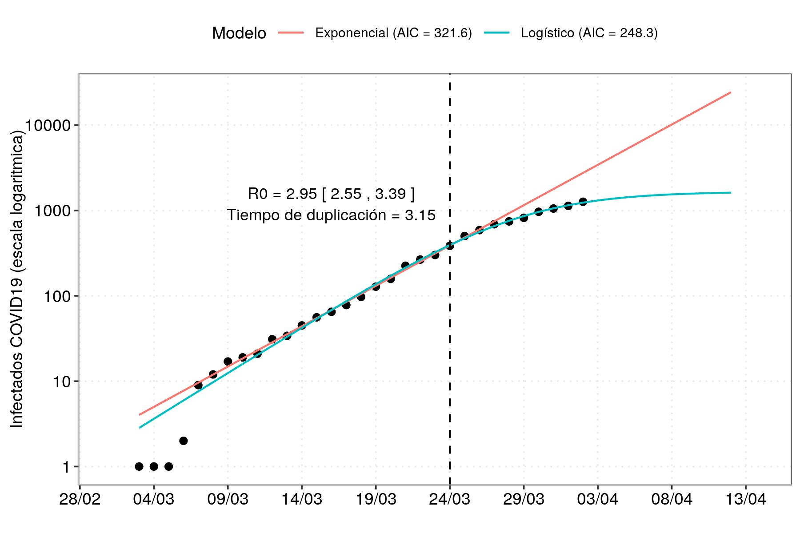
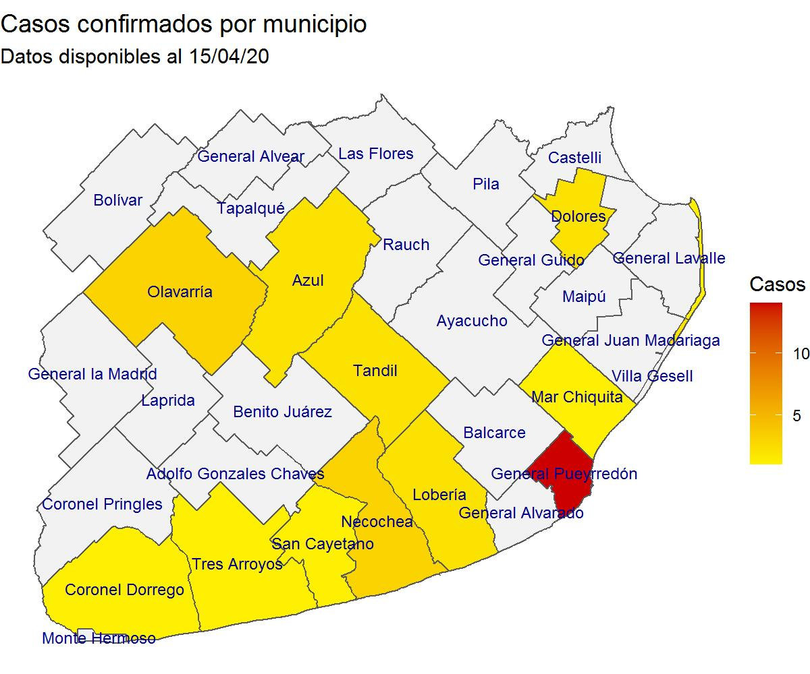

---
---
<br>

```{r _site.R, eval=TRUE, echo=FALSE, warning=FALSE, message=F}
source("_site.R") # especificaciones globales
```

*Fuente de Datos

COVID19 Global: [Johns Hopkins CSSE](https://github.com/CSSEGISandData/COVID-19)

COVID19 Argentina: [Sistemas Mapache](https://github.com/SistemasMapache/Covid19arData)

----

```{r, eval=T}
source('scripts/rates_global.R')
source('scripts/rates_arg.R')
```

<br>

# Status COVID19 global 
`r format(as.Date(Sys.Date(), format = "%Y%m%d"), "%d %b %Y")` 

<br>

<br>


## Factor de crecimiento 

Medida del progreso diario de nuevos casos

<br>

<br>

---- 

## Argentina en relación a los paises limitrofes

- Inicio de epidemia: `r inicio_arg`

- Duración de epidemia al `r format(as.Date(Sys.Date(), format = "%Y%m%d"), "%d %b %Y")`:  *`r dias_epidemia` días*


<br>

<br>


<br>

## Status COVID19 Argentina al 
`r format(as.Date(Sys.Date(), format = "%Y%m%d"), "%d %b %Y")` 

<br>

<br>

## Qué modelo ajusta mejor al progreso de infectados en Argentina?

<br>

<br>

Hasta el dia 21 del comienzo de la epidemia en Argentina ajustaba mejor el modelo exponencial, 
luego el modelo logístico es mejor que el exponencial.

<br>

## Status COVID19 en Sudeste de Buenos Aires  

Fuente:  [Ministerio de Salud de Buenos Aires](https://www.gba.gob.ar/saludprovincia/boletin_epidemiologico)

Semana epidemiológica 13 (21/03/20 al 28/03/20)


```{r}
source('scripts/mapa_sudeste.R')
```




```{r, eval=FALSE}
## Que tipo de infección tenemos?
- importados: personas que volvieron del exterior habiendose contagiado afuera

- contactos: casos por transmisión de contactos estrechos de casos importados

- comunitarios/local: casos referidos como en estudio epidemiológico o sospechoso de comunitarios

```

