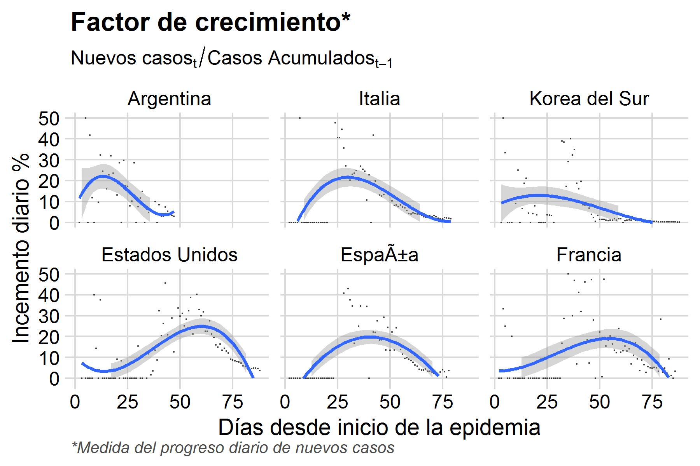
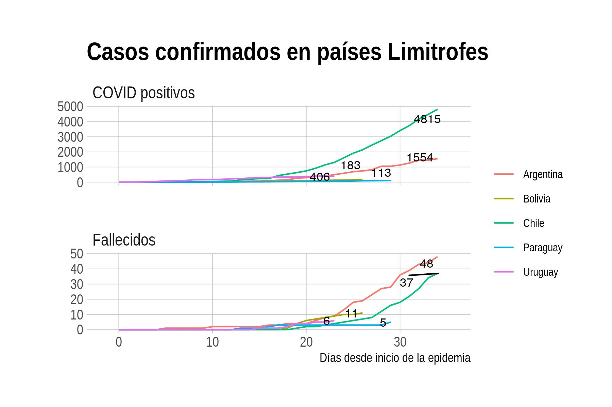
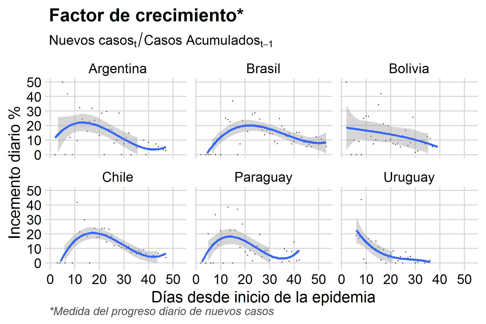

---
---
<br>

```{r, echo = FALSE, message = FALSE, warning = FALSE}
# dglob <- readRDS("~/git_juan/covid19_bce/data/global_2020-03-29.rds") 
# arg <- readRDS("~/git_juan/covid19_bce/data/arg_2020-03-29.rds")
knitr::opts_chunk$set(echo = FALSE, message = FALSE, warning = FALSE)

```

```{r, eval=FALSE}
source('~/git_juan/covid19_bce/scripts/plot_rates_global.R', echo=F)
source('~/git_juan/covid19_bce/scripts/plot_rates_arg.R', echo=F)
```

<br>

# Status COVID19 global `r format(as.Date(Sys.Date(), format = "%Y%m%d"), "%d %b %Y")` 

<br>

<br>


## Factor de crecimiento: medida del progreso diario de nuevos casos

<br>

<br>

## Argentina en relación a los paises limitrofes

<br>

<br>



<br>

## Status Argentina al `r format(as.Date(Sys.Date(), format = "%Y%m%d"), "%d %b %Y")` 

<br>

<br>

## Qué modelo ajusta mejor al progreso de infectados en Argentina?

<br>

<br>

Hasta el dia 21 del comienzo de la epidemia en Argentina ajustaba mejor el modelo exponencial, 
luego el modelo logístico es mejor que el exponencial.

<br>
## Que tipo de infección tenemos?

- importados: personas que volvieron del exterior habiendose contagiado afuera

- contactos: casos por transmisión de contactos estrechos de casos importados, acumulados

- comunitarios: casos referidos como en estudio epidemiológico o sospechoso de comunitarios


